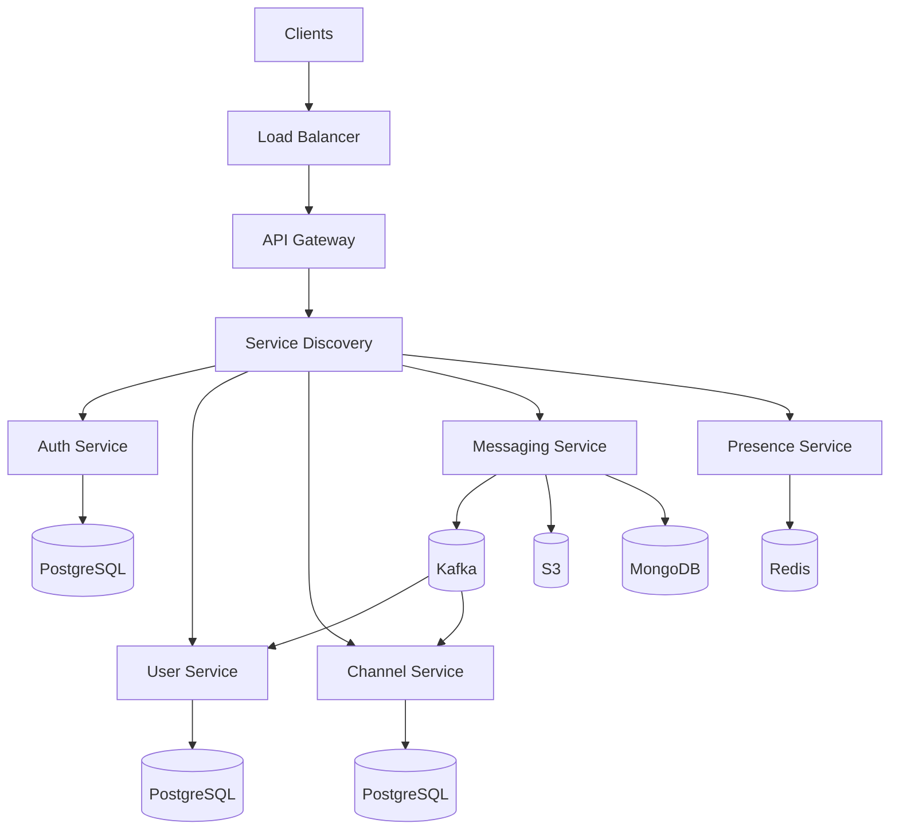

# Architectural Design Report: Slack-like System

---

## 1. Top-Level Architecture Overview

### 1.1 Architectural Pattern
**Microservices with API Gateway**  

The proposed architecture follows a microservices-based design for a Slack-like messaging system. It supports multiple client types (Web, Mobile, Desktop), ensures scalability with a load balancer and service discovery, and uses asynchronous communication via Apache Kafka. The system is built around a modular set of services—each with its own dedicated storage—and supports high availability through replication and distributed storage mechanisms. The design emphasizes clear separation of concerns, fault tolerance, and maintainability.
The system follows a distributed microservices architecture with clear separation of concerns. 

**Key characteristics:**

- **Decentralized Data Management**: Dedicated databases per service
- **Event-Driven Communication**: Apache Kafka for inter-service messaging
- **Horizontal Scalability**: Multiple instances for all critical components
- **Fault Isolation**: Independent deployment units for each service

### 1.2 Architectural Components
Key interactions:

Detailed view:

### 1.3 Key Data Flows
**Client Requests:**

Clients → Load Balancer → API Gateway → Services

**Service Communication:**

Messaging Service → Kafka → (User/Channel Services)

**Data Persistence:**

Services → Dedicated Databases

**File Operations:**

Messaging Service → S3 Storage

## 2. Detailed Component Description
### 2.1 Load Balancer

The Load Balancer serves as the entry point for all client communications, including Web, Mobile, and Desktop platforms. Its primary function is to distribute incoming HTTPS and WebSocket traffic evenly across available instances of the API Gateway, ensuring:

- **Scalability:** It can handle high volumes of concurrent client connections by balancing the load across multiple downstream services.
- **Fault Tolerance:** If an API Gateway instance becomes unavailable, the Load Balancer reroutes traffic to healthy instances, maintaining uninterrupted service.
- **Protocol Support:** Supports both HTTPS and WebSocket, enabling real-time features such as live messaging and presence updates.
The Load Balancer does not contain any business logic; it operates transparently and enhances system performance and reliability through smart routing mechanisms.

### 2.2 API Gateway
The API Gateway is a central access point for all client requests after passing through the Load Balancer. It is designed to simplify communication between clients and backend microservices. The system includes two stateless API Gateway instances, enabling:

- **Load Distribution**: Works with the Load Balancer to handle large volumes of traffic.
- **Fault Tolerance**: Multiple instances ensure high availability; if one fails, others continue to serve traffic.

**Core Responsibilities:**
- **Routing**: Forwards client requests to appropriate backend services via internal service discovery.
- **Health Checks**: Continuously communicates with the Service Discovery component to identify and route traffic only to healthy service instances.
- **Service Abstraction**: Hides the internal structure of the microservices from clients, offering a unified and secure interface.

### 2.3 Discovery Service

Discovery service supports the addition and removal of service instances dynamically without needing to reconfigure clients or other services. Helps in isolating and avoiding unhealthy services, improving system reliability.  Ideal for containerized or cloud-native environments where service instances are frequently created and destroyed.

**Core Responsibilities:**
- **Service Registration:** All backend microservices (Auth, User, Channel, Messaging, Presence) register themselves with the Service Discovery system at startup or when changes occur.
- **Health Monitoring:** The API Gateway uses the Service Discovery component to perform regular health checks and obtain the status of available services.
- **Service Lookup:** Other services can discover and communicate with each other by querying the registry, promoting loose coupling and flexibility in service deployment.

### 2.4 Microservices:

The system architecture consists of several independent and scalable microservices, each responsible for a distinct domain of functionality. All services register with the Service Discovery component and are load-balanced across multiple instances for high availability.

#### 1. Auth (JWT) Service

**Purpose:** Responsible for authentication and issuing JWT tokens for client access.

- **Instances:** 2 stateless instances
- **Database:** Connects to a dedicated PostgreSQL cluster
    - Writes to the PostgreSQL Master
    - Reads from synchronous and asynchronous replicas

- **Responsibilities:**

  - Handle user login and registration

  - Generate and validate JWT tokens

- **Resilience:** Supports read replication and horizontal scaling

#### 2. User Service

**Purpose:** Manages user profiles and related metadata.
- **Instances:** 2 stateless instances
  - **Database:** Connects to a dedicated PostgreSQL cluster
  - Writes to master, reads from replicas
- **Consumes from Kafka:**
  - Topic: `message.created`
  - Used to track user message activity (e.g., unread messages)
- **Responsibilities:**
  - Retrieve and update user profiles
  - React to events related to user activity

#### 3. Channel Service

**Purpose:** Manages chat channels (rooms or groups).

- **Instances:** 2 stateless instances
- **Database:** Dedicated PostgreSQL cluster
- **Consumes from Kafka:**
  - Topic: message.created
  - Used to update channel metadata, such as latest message timestamps
- **Responsibilities:**
  - Create, update, and manage channels
  - Track changes in channels based on messaging activity

#### 4. Presence Service

**Purpose:** Tracks real-time user presence (online/offline status).
- **Instances:** 2 stateless instances
- **Database:** Uses Redis for fast, in-memory access
  - Writes to Redis master
  - Reads from replicas
- **Responsibilities:**
  - Store and query user presence status
  - Provide fast lookups for online/offline indicators

#### 5. Messaging Service

**Purpose:** Handles real-time and stored messaging between users.

- **Instances:** 2 stateless instances
- **Database:** Connects to a MongoDB cluster
  - Writes to primary node
  - Reads from secondaries
- **Message Broker:**
  - Publishes to Kafka (`message.created`)
- **File Storage:** Uploads files (e.g., images) to S3
- **Responsibilities:**
  - Send and store messages
  - Trigger downstream updates through Kafka
  - Handle file attachments via S3 integration

### 2.5 Message Broker

Apache Kafka is used as the central message broker in the system, enabling asynchronous and event-driven communication between microservices. It plays a key role in decoupling services and allowing them to react to domain events without direct dependencies.

**Core Responsibilities:**
- **Event Streaming:** Kafka acts as a queue where microservices can publish or subscribe to domain-specific events.
- **Message Publishing:** The Messaging Service publishes events related to new message creation.
- **Message Consumption:** The User Service and Channel Service subscribe to these events to maintain up-to-date application state and metadata.

**Kafka Topics and Flow:**

| Topic             | Producer          | Consumers                     | Purpose                                                       |
| ----------------- | ----------------- | ----------------------------- | ------------------------------------------------------------- |
| `message.created` | Messaging Service | User Service, Channel Service | Notify about new messages, update user state and channel data |

- `message.created` is triggered when the Messaging Service stores a new message in MongoDB and uploads associated files to S3.
- User Service may update unread counters or personal message logs.
- Channel Service may update the latest activity time or maintain analytics.

### 2.6 Data Layer

The architecture uses a variety of purpose-specific storage systems, each optimized for the needs of the microservice it supports. These include relational databases (PostgreSQL), document-based storage (MongoDB), in-memory key-value store (Redis), and object storage (S3).

#### 1. PostgreSQL Clusters

**Used by:** Auth Service, User Service, Channel Service
Each service has its own dedicated PostgreSQL cluster to avoid cross-service coupling and ensure data isolation.

- **Structure:**
  - One Master node for writes
  - One Synchronous Slave for consistent reads
  - One Asynchronous Slave for eventually consistent reads
- **Purpose:**
  - Store structured, relational data such as users, credentials, and channels
- **Resilience:**
  - Read and write separation for scalability
  - Multi-replica setup for high availability

#### 2. MongoDB Cluster

**Used by:** Messaging Service

- **Structure:**
  - One Primary (Leader) for writes
  - Two Secondaries for reads
  - Replication between leader and replicas
- **Purpose:**
  - Store unstructured or semi-structured data such as chat messages
- **Integration:**
  - Works alongside Kafka and S3
- **Resilience:**
  - Built-in replication supports fault tolerance and read scaling

#### 3. Redis Cluster

**Used by:** Presence Service

- **Structure:**
  - One Master node for writes
  - Two Asynchronous Slaves for reads
- **Purpose:**
  - Maintain fast access to real-time presence information (e.g., online/offline users)
- **Characteristics:**
  - In-memory data store for low-latency reads/writes
  - Ideal for ephemeral, high-frequency data
- **Resilience:**
  - Supports asynchronous replication and read distribution

#### 4. S3 (Object Storage)

**Used by:** Messaging Service

- **Purpose:**
  - Store file attachments (images, documents) sent in messages
- **Interaction:**
  - Files are uploaded directly by the Messaging Service
  - Decouples file storage from message metadata stored in MongoDB
